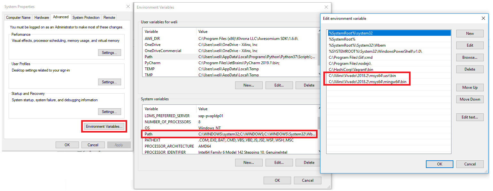

# High-Level-Synthesis-Flow-on-Zynq-using-Vivado-HLS

This course provides users with an understanding of high-level synthesis design methodologies necessary to develop digital systems using Vivado HLS 2018.2 version.

## Required Setup

Clone this repository and then copy the **sources** directory as **labs** to a working directory. The recommended working directory is **c:/xup/hls**.  After copying the directory, all labs will be carried out in their respective folders located at **c:/xup/hls/labs**. 

---
#### In the instructions for the labs;

**{labs}** refers to **c:/xup/hls/labs**.

---
**NOTE**

Board support for the PYNQ-Z1/Z2 are not included in Vivado 2018.2 by default. The relevant files need to be extracted and saved to:

 {Vivado installation}\data\boards\board_files\zynq

These files can be downloaded from   

PYNQ-Z1:[/board_files](https://www.xilinx.com/support/documentation/university/vivado/workshops/vivado-adv-embedded-design-zynq/materials/2018x/PYNQZ1/pynq-z1.zip). 

PYNQ-Z2:[/board_files](https://www.xilinx.com/support/documentation/university/vivado/workshops/vivado-adv-embedded-design-zynq/materials/2018x/PYNQZ2/pynq-z2.zip). 

You should also configure the windows system enviroment variables before starting the labs

---

## Hardware Setup

**PYNQ-Z1/Z2**:  Connect the board to the PC using a micro USB cable. Make sure that a jumper is connected to JTAG (between JP1_1 and JP1_2) to use the board in the development mode. Also, make sure that another jumper is placed between J9_2 and J9_3 to select USB as a power source.

---

## Labs Overview

### Lab1:

This lab provides a basic introduction to high-level synthesis using the Vivado HLS tool flow. You will use
Vivado HLS in GUI mode to create a project. You will simulate, synthesize, perfrom design analysis, and implement the provided
model.

### Lab2:

This lab introduces various techniques and directives which can be used in Vivado HLS to improve
design performance. The design under consideration accepts an image in a (custom) RGB format,
converts it to the Y’UV color space, applies a filter to the Y’UV image and converts it back to RGB.

### Lab3:

This lab introduces various techniques and directives which can be used in Vivado HLS to improve
design performance as well as area and resource utilization. The design under consideration performs
discrete cosine transformation (DCT) on an 8x8 block of data.

### Lab4:

This lab introduces a design flow to generate a IP-XACT adapter from a design using Vivado HLS and
using the generated IP-XACT adapter in a processor system using IP Integrator in Vivado.

**Note.** Since PYNQ-Z1 board does not have Audio CODEC chip, this lab cannot be ported/verfied on the board, though design flow is still applicable to the board.
